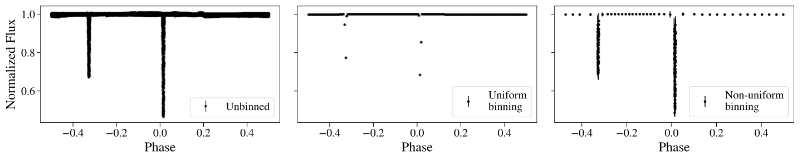

# eclipsebin:
<span style="font-size: 20px;">A package for non-uniformly binning eclipsing binary star light curves.</span>


[](https://pypi.org/project/eclipsebin/)
[](https://codecov.io/gh/jackieblaum/eclipsebin)




## Overview

This Python package provides a specialized binning scheme designed to more effectively capture the features of eclipsing binary star light curves. Unlike **traditional uniform binning (middle panel)**, which can dilute the crucial details of eclipses, this **non-uniform binning method (right panel)** prioritizes the accurate representation of eclipse events. While the default parameters of this package are optimized for detached systems, the binning scheme can also be effectively applied to semi-detached and contact systems by adjusting these parameters.

## Key Features

- **Eclipse-Focused Binning**: The binning algorithm identifies the eclipse phases and allocates up to half of the total bins to these critical periods. The remaining bins are distributed across the out-of-eclipse regions.
  
- **Optimized Data Distribution**: Using the `pandas qcut` function, the package ensures that each bin within the eclipse and out-of-eclipse segments contains approximately the same number of data points, maintaining the integrity of the light curve's structure.
  
- **Enhanced Accuracy**: By concentrating bins around the brief, narrow eclipse phases, the method improves the resolution of these events, which are essential for deriving accurate parameters of the binary system.

## Why Use This Binning Scheme?

Eclipses in binary star systems contain vital information about the system's properties, such as the relative sizes, masses, and orbital parameters of the stars. Standard uniform binning can obscure these details, especially when the eclipse duration is short relative to the orbital period. This package mitigates that issue by adaptively placing more bins where they matter most—during the eclipses—thereby preserving the fidelity of the light curve and improving the subsequent analysis.

## How it Works
- **Eclipse Detection**: The package first identifies the primary and secondary eclipse phases. The primary eclipse is located by finding the minimum flux, and the secondary eclipse is located by finding the minimum flux at least 0.2 phase units away from the primary eclipse. 

- **Eclipse Boundaries**: The package defines the boundaries of the eclipses as the points where the flux returns to 1.0 flux units, or the closest point to 1.0 flux units if the flux does not return to 1.0.

- **Bin Groups**: The package then groups the data into four segments: the two eclipse regions and the two out-of-eclipse regions. A specified fraction of the total number of bins is split between the eclipse regions, and the remaining bins are split evenly between the out-of-eclipse regions.

- **Binning**: The package then uses the `pandas qcut` function within each group to bin the data into a specified number of bins. This function bins the data such that there are an approximately equal number of points within each bin for the given group.

- **Plotting**: The package also provides a function to plot the binned and unbinned light curves, marking the eclipse boundaries with vertical lines.

## Light Curve Requirements

- At least 10 flux measurements with associated uncertainties, covering both eclipses and out-of-eclipse regions.
- Primary and secondary eclipses must be distinguishable by identifying the minimum flux values.
- The secondary eclipse minimum must occur at least 0.2 in phase away from the primary eclipse minimum. A future version will allow this value to be specified as a keyword argument.
- The minimum flux value across the light curve, outside the 0.4 phase region around the primary eclipse, must belong to the secondary eclipse.
- Fluxes should ideally be normalized so that out-of-eclipse regions have a flux value close to 1.
- Two eclipses must be present in the light curve. A future version will support binning for light curves with only one eclipse.
- Optional: If the binning scheme is not producing the desired result, ensure that the eclipses do not cross the phase boundary.
  
## Getting Started

To start using the package, install it via pip:

```bash
pip install eclipsebin
```

## Usage

```bash
import eclipsebin as ebin

# Example usage
binner = ebin.EclipsingBinaryBinner(phases, fluxes, fluxerrs, nbins=200, fraction_in_eclipse=0.5, atol_primary=0.001, atol_secondary=0.05)
bin_centers, bin_means, bin_stds = binner.bin_light_curve(plot=True)
```

<!-- For GitHub -->
<!--
<span >Refer to the [documentation](https://jackieblaum.github.io/eclipsebin/) for more detailed usage instructions and examples.</span>
-->

## Contributing

Contributions are welcome! Please refer to the [Contributing Guide](CONTRIBUTING.md) for guidelines on how to help improve this project.

## License

This project is licensed under the MIT License - see the [LICENSE](LICENSE) file for details.

## Acknowledgments

<!-- For GitHub -->


<!-- For MkDocs (Read the Docs) -->


This material is based upon work supported by the National Science Foundation Graduate Research Fellowship Program under Grant No. 2206744 & DGE 2146752. Any opinions, findings, and conclusions or recommendations expressed in this material are those of the author(s) and do not necessarily reflect the views of the National Science Foundation.
