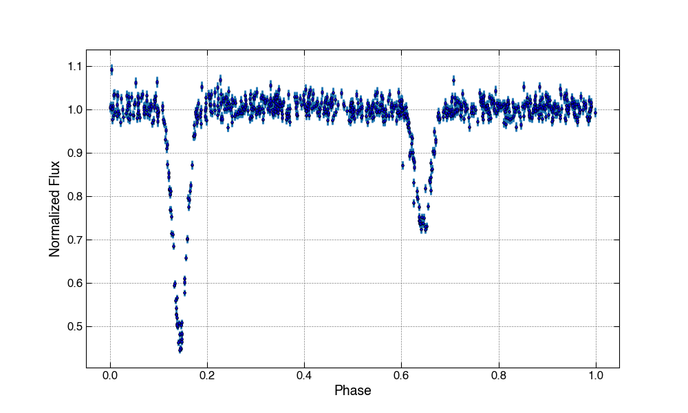
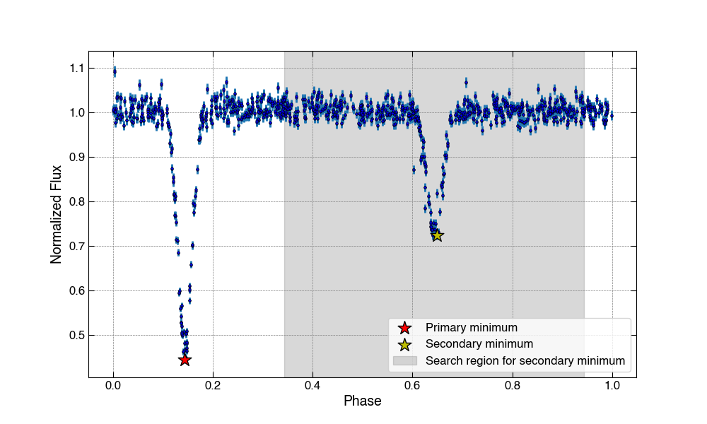
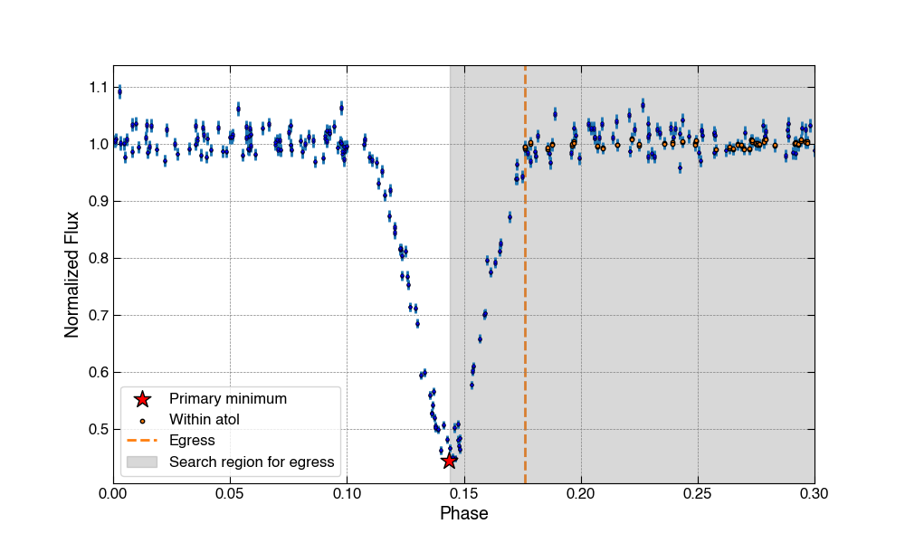
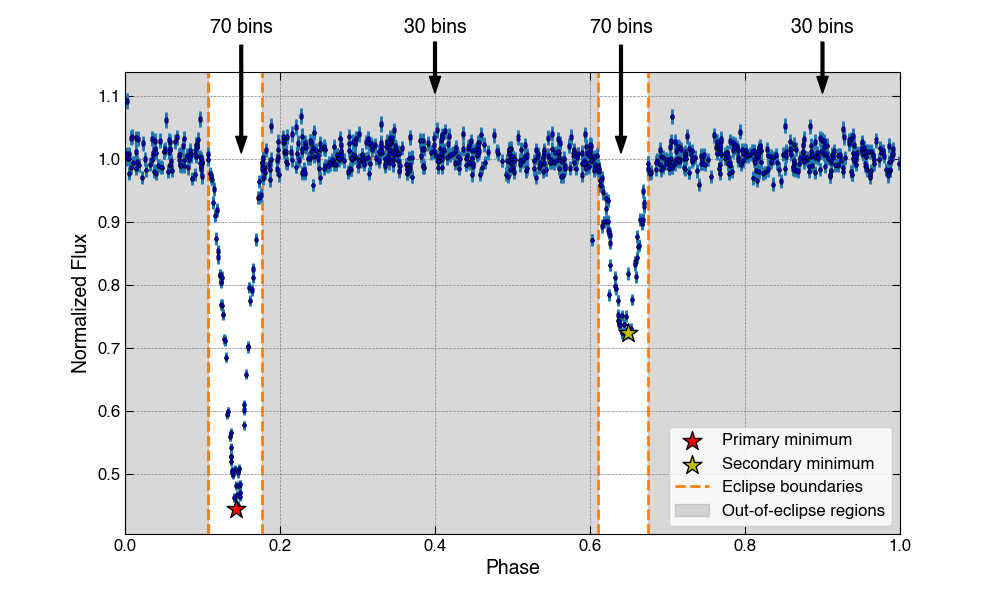
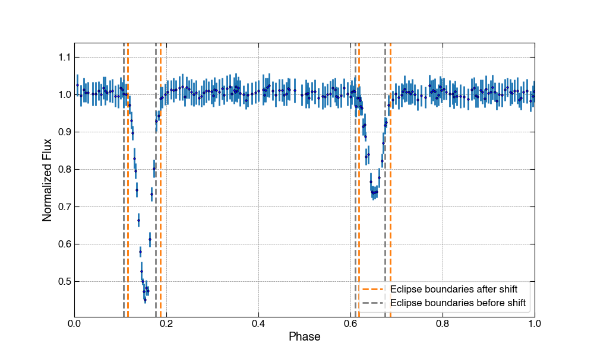
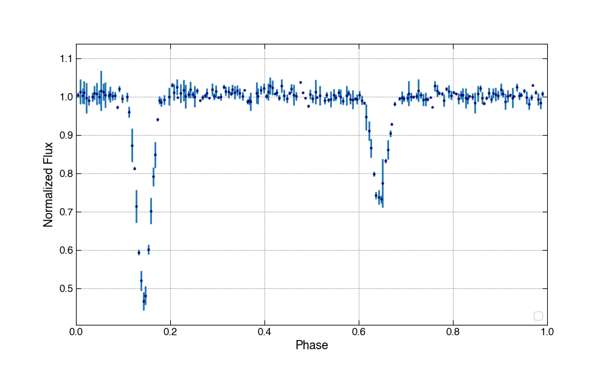

# How the Binning Scheme Works

## Overview

This binning scheme divides an eclipsing binary light curve into four segments: two eclipse regions and two out-of-eclipse regions. The user can specify the fraction of the total bins `nbins` that should be placed within the eclipse regions, `fraction_within_eclipse`. Within each segment of the light curve, bins are chosen such that an approximately equal number of data points fall within each bin.

Consider the following light curve as an example. In all cases, the code assumes that the light curve has been normalized such that the out-of-eclipse flux is close to one.

## Eclipse Detection

### Eclipse minima

**Primary eclipse minimum:** This code assumes that the overall minimum flux value of the light curve falls within the primary eclipse (it's okay if this isn't the true minimum of the primary eclipse).

**Secondary eclipse minimum:** To find the secondary eclipse, the code searches the section of the light curve falling at least 0.2 in phase in either direction. The minimum flux value within this section is taken to be the secondary eclipse minimum (again, it's only necessary that this minimum falls within the secondary eclipse).

### Eclipse ingress and egress

**Ingress:** To find the approximate location of the start of the eclipse, the code examines the phases prior to that of the eclipse minimum found in the previous step. Given the absolute tolerance `atol_primary` or `atol_secondary`, which may be specified by the user, the code selects the greatest phase for which the flux is close to one within the selected region.

**Egress:** Same thing, except in the other direction.

Let's take a look at the primary eclipse detection for our example light curve. In this case, `atol=0.01`.

## Binning

### Bin distribution

Given the desired number of total bins `nbins`, the code determines the number of bins that will fall within each of the four segments of the light curve. 

The code first delegates bins to the eclipse regions. The number of bins to place within the eclipse regions is determined by multiplying `fraction_within_eclipse` by `nbins`. The bins are then divided equally between the two eclipses (with the primary holding an additional bin in the case of an odd number). In the case that there are more desired bins than data points falling within an eclipse region, the number of bins is reduced to equal that number of data points. The remainder of the bins are divided equally within the out-of-eclipse regions.

Let's say we want to bin our example light curve with `nbins=200` and `fraction_within_eclipse=0.7`. These inputs indicate that the code should give us `200*0.7=140` bins within the two eclipses, or `140/2=70` bins per eclipse. The remaining `200-140=60` bins will be split between the two out-of-eclipse-regions.

### Binning within each segment

Once the bin distribution has been calculated, [`pandas.qcut()`](https://pandas.pydata.org/docs/reference/api/pandas.qcut.html) applies a quantile-based discretization function to calculate bin edges such that an approximately equal number of data points fall within each phase bin. This choice of binning helps to retain important features of the light curve while maintaining a specified number of bins.

### Phase shift

To avoid having a bin that wraps around phase 1, the code slightly shifts the phase data and bin edges after binning such that the rightmost bin edge is moved to 1.

Here is our light curve example after binning. The difference between the dashed gray lines (eclipse boundaries pre-shift) and orange lines (eclipse boundaries post-shift) indicates the magnitude of this phase shift.

For comparison, here is the result of using standard uniform binning techniques:

